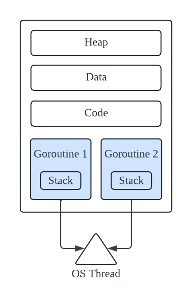
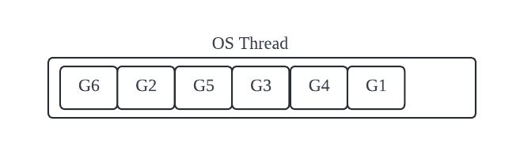
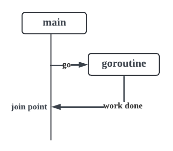

# Goroutines

## Communicating Sequential Processes(CSP)

Go에서 동시성은 Communicating Sequential Processes(CSP)에 대해 Tony Hoare가 작성한 논문이 바탕이 된다. CSP는 매우 간결하다. CSP는 3가지 핵심 아이디어를 기반으로 한다.

- 각 프로세스는 **순차적 실행**(Sequential execution)으로 구성된다.
  - 모든 프로세스에는 로컬 상태가 있으며 프로세스는 해당 로컬 상태에서 작동한다.
- 한 프로세스에서 다른 프로세스로 데이터를 전송해야 하는 경우 **메모리를 공유하지 않고**(No shared memory) 데이터를 통신하여 다른 프로세스로 데이터 사본을 보낸다.
  - 메모리 공유가 없기 때문에 경쟁 상태, 데드락이 없다.
- 각 프로세스가 독립적으로 실행될 수 있기 때문에 쉽게 **확장**(Scale)할 수 있다.
  - 계산에 더 많은 시간이 소요되는 경우 동일한 유형의 프로세스를 더 추가하고 계산을 더 빠르게 실행할 수 있다.

## Go's Concurrency Tool Set

- goroutines
- channels
- select
- sync package

## 고루틴(Goroutines)

- 고루틴은 Go runtime에 의해 관리되는 **사용자 공간 스레드**(user space threads)이다.
- Go runtime은 실행 파일의 일부이다. 애플리케이션의 실행 파일에 내장되어 있다.
- 고루틴은 매우 가볍다.
- 고루틴은 필용에 따라 성장하고 축소할 수 있는 **2KB의 스택**(2KB of stack)으로 시작한다.
- **CPU 오버헤드가 매우 낮다**.(Low CPU overhead)
- 고루틴을 만드는 데 필요한 CPU 명령의 양이 매우 적다.
- 동일한 주소 공간에 **수십만 개의 고루틴**을 만들 수 있다.
- 고루틴 간에 **채널을 사용하여 데이터를 전달**하여, 메모리 공유를 피할 수 있다.
- 스레드 컨텍스트 전환에 비해 고루틴 **컨텍스트 전환 비용이 적다**.
- Go runtime은 데이터를 영속화하고 검색하기 위해 어떤 것을 영속화할지, 어떻게 영속화할지, 그리고 언제 영속화해야 하는지에 대해 보다 선택적으로 작동할 수 있다.
- Go runetime은 OS 스레드를 생성한다.
- 고루틴은 OS 스레드의 컨텍스트에서 실행된다. **** 중요 *****



- 많은 고루틴이 단일 OS 스레드의 컨텍스트에서 실행될 수 있다.
- 운영체제는 OS 스레드를 스케줄링한다.
- Go runtime은 OS 스레드에서 여러 고루틴의 스케줄링을 관리한다.
- 운영체제는 변경된 것이 없으며 여전히 스레드를 예약하고 있다.



## 결론

### 고루틴(Goroutine)이란

- Go runtime에 의해 관리되는 사용자 공간 스레드이다.

### 고루틴의 장점 (OS 스레드에 비하여)

- 고루틴은 OS 스레드에 비해 매우 경량이다.
- OS 스레드의 스택 사이즈인 8MB에 비해 고루틴의 스택 사이즈는 2KB로 매우 작다.
- 사용자 공간에서 발생하기 때문에 컨텍스트 전환 비용이 매우 적다. 고루틴은 저장할 상태가 매우 적다.
- 동일한 머신에서 수십만 개의 고루틴을 생성할 수 있다.

# WaitGroups

## 이 프로그램에서 가능한 출력값은?

```go
func main() {
  var data int

  // 메인 루틴과 동시에 실행되는 goroutine
  // 메인 루틴이 data의 값을 확인하기 전에 고루틴이 생성되고 실행된다는 보장이 없다!
  go func() { 
    data++
  }()

  // 메인 루틴은 data가 0인지 확인하고 출력한다
  if data == 0 {
    fmt.Printf("the value is %v\n", data)
  }
}
```

| Output | Execution sequence |
| --- | --- |
| 아무 것도 출력되지 않음 | Line 8, 12 | 
| the value is 0 | Line 12, 13 |
| the value is 1 | Line 12, 8, 13 |

## Race Condition

- 동시성을 관리할 때, race condition을 고려해야 한다!
- race condition은 원하는 결과를 얻기 위해 두 가지 이상의 작업을 올바른 순서로 실행해야 할 때 발생한다.
- 대부분의 경우 개발자들은 프로그램이 코드화된 순서대로 실행된다고 생각한다.
- 동시 프로그램에서는 그렇지 않다.
- 위 코드에서는 메인 루틴이 data의 값을 확인하기 전에 고루틴이 생성되고 실행된다는 보장이 없다!
- 고루틴은 메인 루틴에서 비동기식으로 실행된다.
- 메인 루틴과 고루틴이 실행할 순서는 결정적이지 않다.

## 프로그램에 결정론 도입하기

메인 루틴이 data 값을 확인하기 전에, 고루틴이 실행될 때까지 기다리도록 할 수 있을까?

## WaitGroup

- Go는 **fork and join**이라는 논리적 동시성 모델을 따른다.



- 메인이 고루틴을 기다리지 않으면 고루틴이 실행될 기회를 얻기 전에 프로그램이 종료될 가능성이 매우 높다.
- join point를 만들기 위해 `sync.WaitGroup`을 사용하여 메인 루틴을 블록(block)한다.

```go
  var wg sync.WaitGroup
  wg.Add(1) // Add(생성할 고루틴 수)

  go func() {
    defer wg.Done() // 고루틴 클로저 내부에서 Done() 호출 -> 고루틴이 빠져나가고 있음을 나타낸다 (defer: 함수의 모든 종료 포인트에서 호출되는게 보장됨)
    // ...
  }()

  wg.Wait() // Wait() - 모든 고루틴이 종료될 때까지 메인 루틴을 블록한다.
```

- `WaitGroup`은 동시성 카운터와 같다. `Add`를 통해 원하는 값을 추가하고, `Done`을 통해 1을 감소시킨다. `Wait`을 호출하여 카운터가 0이 될 때까지 블록한다.