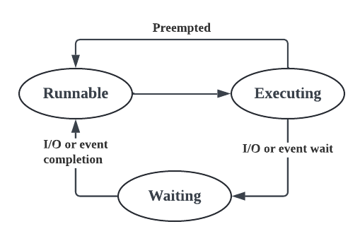
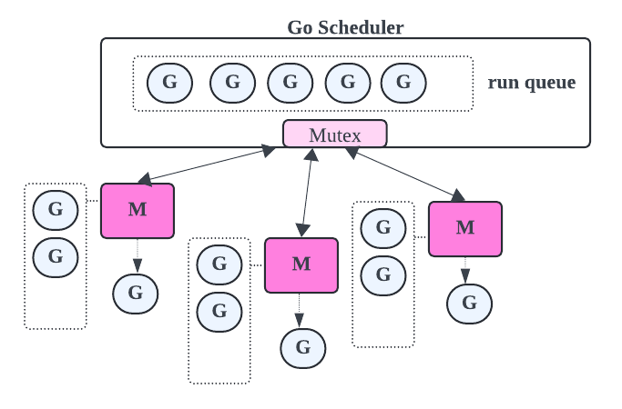
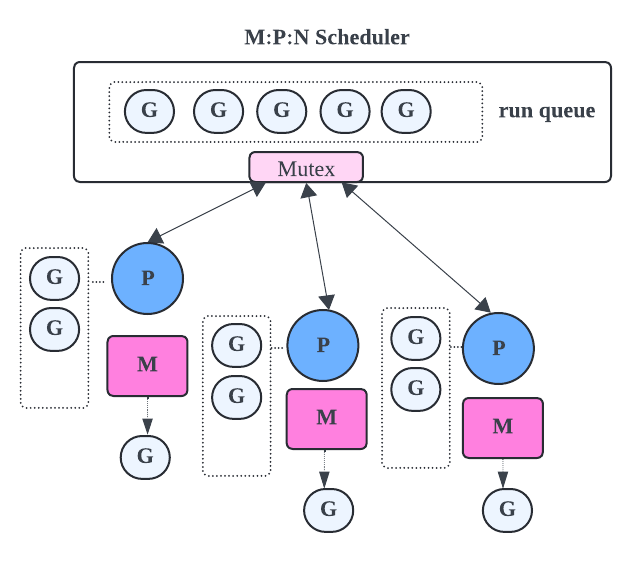
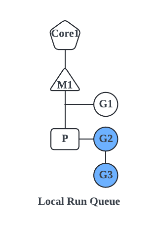
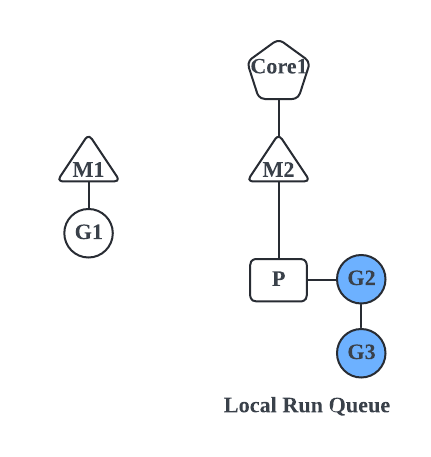
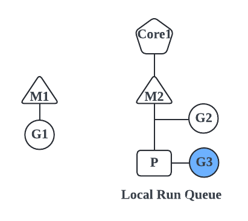
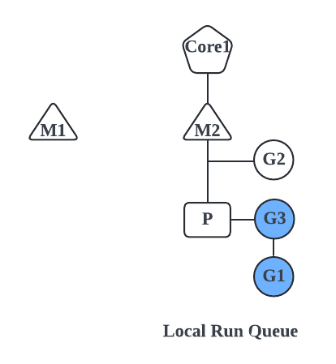
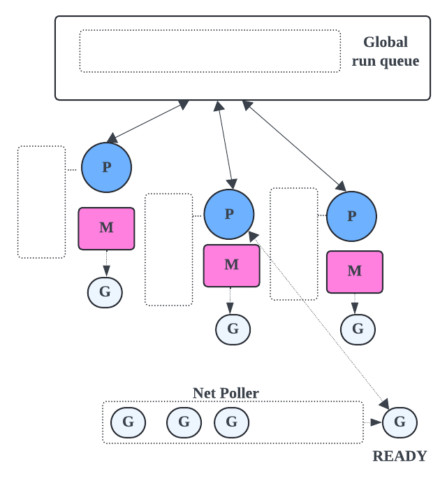
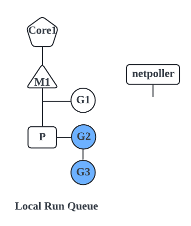
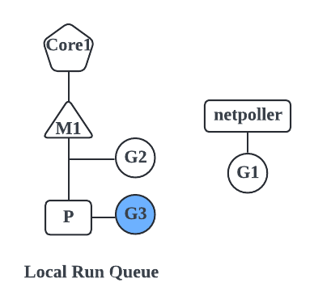

# Go 스케줄러(Go Scheduler)

컴퓨팅에서 스케줄러는 다음에 어떤 프로세스를 실행해야 할지 결정하는 프로그램이다. Go 스케줄러는 커널 스레드에 대한 고루틴의 스케줄링을 담당한다. 스케줄러의 종류는 다양하지만 우리가 관심을 가지고 있는 것은 **사용자 공간 스케줄러**(user space scheduler)이다. 사용자 공간 스케줄러는 사용자 공간과 커널 공간 사이의 작업을 스케줄링하는 역할을 한다.

## M:N Scheduler

사용자 공간 스케줄러에는 여러 종류가 있지만, Go 런타임으로 구현되는 스케줄러인 M:N 스케줄러에 대해 알아보자. M:N 스케줄러는 N개의 고루틴을 M개의 커널 스레드에 매핑하는 스케줄러이다. M:N 스케줄러는 Go 런타임에 구현되며, 커널 스레드에 고루틴을 스케줄링하는 역할을 한다.

이러한 스케줄러의 장점은 유연하고 커널 스레드보다 더 많은 고루틴이 존재할 수 있다는 것이다.

- Go 스케줄러는 Go 런타임의 일부이다.
- Go 런타임은 실행파일의 일부이다. 애플리케이션의 실행파일에 내장되어 있다.
- Go 스케줄러는 M:N 스케줄러라고도 한다.
- Go 스케줄러는 사용자 공간에서 실행된다.
- 고루틴은 Go 스케줄러에 의해 OS 스레드에서 예약된다. 따라서, 고루틴은 OS 스레드의 컨텍스트에서 실행된다.
- Go 런타임은 `GOMAXPROCS` 환경변수 값과 동일한 수의 worker OS 스레드를 생성한다.
- `GOMAXPROCS`의 기본값은 시스템의 프로세서 수이다.
- 코어가 4개 있으면 OS 스레드가 4개 생성되고, 코어가 8개 있으면 OS 스레드가 8개 생성된다.
- 실행 가능한 고루틴을 생성된 여러 스레드에 분배하는 것은 Go 스케줄러의 책임이다.
- 최대 `GOMAXPROCS` 개수의 프로세서에서 실행되는 M개의 OS 스레드에서 N개의 고루틴을 예약할 수 있다.

## Asynchronous Preemption

스케줄러에서 중요한 개념인 선점에 대해 알아보자. 선점이란 스케줄러가 현재 실행 중인 고루틴을 선점(정지)하고 다른 고루틴을 실행하는 기능이다. 이는 특정 고루틴이 많은 시간을 소모하지 않도록 하고 다른 고루틴이 실행할 기회를 주기 위한 것이다.

스케줄러는 타임 슬라이스를 사용하여 고루틴을 선점할 시기를 결정한다. 타임 슬라이스는 10ms이다. 고루틴이 10ms 이상 실행되면 스케줄러가 이를 선점하고 다른 고루틴을 실행한다.

선점된 고루틴이 FIFO 큐인 글로벌 실행 큐의 끝에 추가된다. 이는 글로벌 실행 큐의 다른 모든 고루틴 이후에 고루틴이 실행된다는 것을 의미한다.

- Go 1.14를 기준으로, Go 스케줄러는 비동기 선점을 구현한다.
- 오랜 시간 실행되는 루틴이 CPU를 독차지하면 어떻게 될까? 다른 고루틴은 블락될 것이다.
- 그래서 비동기 선점이 구현되게 되었다.
- 비동기 선점에서는 고루틴에 실행을 위해 10ms의 타임 슬라이스가 제공된다.
- 타임슬라이스가 끝나면, Go 스케줄러가 선점을 시도한다.
- 이를 통해 CPU에 바운드된 고루틴이 오래 실행 중인 경우에도 다른 고루틴에게 기회를 제공할 수 있다.

## 고루틴 상태(Goroutine States)

- `Runnable`: 고루틴은 실행 준비가 되어 커널 스레드가 실행하기를 기다릴 때 상태이다. 고루틴이 생성되었을 때 또는 블락이 해제된 후에 Runnbale 상태가 될 수 있다.
- `Running`: 커널 스레드에 의해 실행되고 있을 때 Running 상태이다.
- `Waiting`: 이벤트가 발생하기를 기다리고 있을 때 Waiting 상태이다. 이는 채널 연산, 시스템 호출, 또는 뮤텍스가 될 수 있다.

1. 고루틴이 생성되면, **Runnable** 상태가 된다. 실행 대기열에서 대기한다.
2. 고루틴이 OS 스레드에 예약되면, **Executing** 상태가 된다.
3. 고루틴이 타임 슬라이스 동안 실행되면 선점되어 실행 대기열에 다시 배치된다.
4. 고루틴이 어떠한 조건들(채널에서 블락되거나, syscall에서 블락되거나, mutex lock을 기다리는 등)로 인해 블락되면 **Waiting** 상태가 된다.
5. I/O 작업이 완료되면 다시 **Runnable** 상태가 된다.



## Go 스케줄러의 구성 요소

- P(Processor): 논리적 프로세서로, 고루틴의 스케줄링을 관리한다. P는 실제 CPU 코어가 아니라, Go 런타임에서의 논리적인 개념이다. P는 여러 개의 M에 할당될 수 있다.
- M(OS Thread): 운영체제 스레드를 나타내며, Go 프로그램이 실제로 실행되는 곳이다. 각 M은 하나의 운영체제 스레드를 나타내며, 고루틴을 실행하고 시스템 호출을 수행한다.
- G(Goroutine): 고루틴은 가벼운 스레드이다. 각각의 고루틴은 자체 스택과 명령어 포인터를 가지고 있으며, Go 프로그램의 실행 단위로 사용된다. 스케줄링 정보와 함께 로컬 실행 큐에 저장된다.
- Local Run Queue: 로컬 실행 큐는 해당 프로세서(P)에 대한 실행 가능한 고루틴을 저장한다. 이 큐에 있는 고루틴들은 해당 프로세서에서 실행되기를 기다린다.
- Global Run Queue: 글로벌 실행 큐는 모든 프로세서에 대한 공유 실행 큐이다. 새로운 고루틴이 생성되면 이 큐에 추가된다. 여기서 고루틴은 각각의 프로세서로 스케줄될 때까지 대기한다.

### 로컬 실행 큐(Local Run Queue)

로컬 실행 큐는 커널 스레드에 로컬인 실행 큐이다. 이는 각 커널 스레드에 실행 큐가 있음을 의미한다. 이렇게 하면 각 커널 스레드에 실행 큐가 있고, 리소스 공유 측면에서 다른 커널 스레드의 영향을 받지 않기 때문에 공정성 문제가 해결된다.

로컬 실행 큐에 per-thread 상태라는 개념이 도입되었다.



로컬 실행 큐는 최대 256개의 고루틴을 가질 수 있다. 로컬 실행 큐가 가득 차면 고루틴은 글로벌 실행 큐에 추가된다. 글로벌 실행 큐는 모든 커널 스레드 간에 공유되는 큐이다.

## M:P:N 스레딩 모델

p-thread 상태의 도입에 따라서, 시스템 호출에서 스레드가 블락되었을 경우 스레드는 로컬 실행 큐를 유지할 필요가 없어졌다. 해당 고루틴들은 다른 곳에서 실행될 것이다.

워크 스틸링은 작업 부하를 다시 균형잡기 위해 사용된다. 그러나 워크 스틸링을 구현하면 스레드의 수가 무한정으로 늘어날 수 있다.

이 무넺를 해결하기 위해 스케줄러는 M:P:N 스레딩 모델을 사용하도록 변경되었다. 여기서 M은 커널 스레드의 수, N은 고루틴의 수, P는 프로세서의 수를 나타낸다. 프로세서 개수는 GOMAXPROCS의 최대 개수이다. P는 로컬 실행 큐, 글로벌 실행 큐 및 커널 스레드 간 상호 작용을 관리한다.

이러한 변경으로 인해 스케줄러는 더 효율적으로 고루틴을 관리하고 시스템 리소스를 효율적으로 활용할 수 있게 되었다.



## 요약

### Go 스케줄러는 어떻게 동작하는가?

- Go 런타임은 M:N 스케줄러로 알려진 메커니즘이 있다.
- N개 고루틴은 최대 `GOMAXPROCS` 개의 프로세서에서 실행되는 M개의 OS 스레드에서 예약할 수 있다.
- Go 1.14를 기준으로 Go 스케줄러는 각 고루틴에 10ms의 타임 슬라이스가 제공되는 비동기 선점을 구현한다.

# 동기적 시스템 호출로 인한 컨텍스트 전환(Context Switching due to Synchronous System Call)

일반적으로 고루틴이 동기화 시스템 호출(예를 들면, sync 플래그가 설정된 파일을 읽거나 쓰는 것)을 하면 어떻게 될까? 

디스크 I/O가 수행되어야 하므로, 동기 시스템 호출은 I/O 작업이 완료될 때까지 기다린다.

OS 스레드는 CPU에서 I/O가 완료될 때까지 Waiting 대기열로 이동한다. 따라서 해당 스레드에서 다른 고루틴을 예약할 수 없다.

이 점에서 동기적 시스템 호출이 병렬성을 감소시킬 수 있다는 것을 알 수 있다. 그렇다면 Go 스케줄러는 이 시나리오를 어떻게 처리할까?

## 동기적 시스템 호출(Synchronous system call)



```go
count, err := f.Read(data)

```

- OS 스레드 M1 에서 고루틴 G1이 실행되고 있다.
- G1에서 동기적 시스템 호출(eg. 파일 읽기)을 생성한다. 이는 OS 스레드 M1을 블락하게 만든다.
- Go 스케줄러는 G1이 OS 스레드 M1을 블락한 것을 식별하므로, 스레드풀 캐시에서 새 OS 스레드를 가져오거나 스레드풀 캐시에서 스레드를 사용할 수 없는 경우 새 OS 스레드를 생성한다.
- Go 스케줄러는 논리 프로세서 P를 OS 스레드 M1에서 분리하고 새로운 OS 스레드 M2로 이동한다.
- G1은 여전히 이전 OS 스레드 M1에 연결되어 있다.



- 논리 프로세스 P는 이제 OS 스레드 M2에서 실행하기 위해 로컬 실행 큐에서 다른고루틴을 스케줄링할 수 있다.



- G1이 수행한 동기식 시스템 호출이 완료되면 논리 프로세서 P의 로컬 실행 큐 끝으로 다시 이동한다.



- M1은 sleep 상태가 되어 스레드풀 캐시에 놓이게 된다. 앞으로 같은 시나리오가 다시 발생할 때 활용할 수 있다.

## 요약

고루틴이 동기적 시스템 호출을 하면 컨텍스트 전환은 어떻게 동작할까?

- 고루틴이 동기적 시스템 호출을 하면, Go 스케줄러는 스레드풀로부터 새로운 OS 스레드를 가져온다.
- 논리 프로세서 P를 새로운 스레드로 이동시킨다.
- 시스템 호출을 한 고루틴은 기존 스레드에 붙어 있다.
- 로컬 실행 큐에 있는 다른 고루틴들은 새로운 OS 스레드에서 실행을 위해 스케줄된다.
- 시스템 호출이 리턴되면, 시스템 호출을 수행한 고루틴은 다시 논리 프로세서의 로컬 실행 대기열로 이동되고, 이전 스레드는 sleep 모드로 전환된다.

# 비동기적 시스템 호출로 인한 컨텍스트 전환(Context Switching due to Asynchronous System Calls)

비동기적 시스템 호출을 하면 어떤 일이 일어날까?

네트워크 I/O 작업을 수행하는 데 사용되는 파일 디스크립터(file descriptor)가 논블로킹 모드로 설정되어 있을 때, 비동기적 시스템 호출이 발생한다.

파일 디스크립터가 준비되지 않은 경우, 예를 들어, 소켓 버퍼가 비어 있을 때 읽으려고 하거나 소켓 버퍼가 꽉 찼을 때 파일에 쓰려고 하면, 읽기 또는 쓰기 작업은 블록되지 않고 오류를 반환한다. 애플리케이션은 나중에 작업을 다시 시도해야 한다. 따라서 애플리케이션의 복잡성이 커진다.

애플리케이션은 이벤트 루프를 생성하고 콜백을 설정하거나 파일 디스크립터와 함수 포인터를 매핑하는 테이블을 유지해야 한다. 또한 예전에 읽은 데이터의 양이나 예전이 쓴 데이터의 양을 추적하기 위해 상태를 유지해야 한다. 이 모든 것들은 애플리케이션의 복잡성을 가중시킨다.

이 시나리오를 Go는 어떻게 다룰까?

## Network Poller

네트워크 폴러는 네트워크 I/O와 같은 비동기 시스템 호출을 처리하는 Go 런타임의 구성요소이다. 예를 들어, 고루틴이 네트워크 요청이 완료되기를 기다리는 경우, 고루틴은 네트워크 폴러에 추가된다. 이는 커널 스레드를 블록하는 것을 피하기 위한 것이다.

글로벌 실행 큐도 비어 있으면 프로세서가 네트워크를 폴링해야 한다.

네트워크 폴러에 실행 가능한 고루틴이 있으면(ready) 프로세스는 해당 고루틴을 로컬 실행 큐에 추가한다.



- Go는 netpoller를 사용한다.
- syscall 패키지에 내장된 추상화가 있다.
- syscall 패키지는 netpoller를 사용하여 비동기 시스템 호출을 블로킹 시스템 호출로 변환한다.
- 고루틴이 비동기적 시스템 호출을 수행할 때 파일 디스크립터가 준비되지 않은 경우, Go 스케줄러는 netpoller OS 스레드를 사용하여 해당 고루틴을 파킹한다.
- netpoller는 Linux의 epoll, MacOS의 kqueue, Windows의 iocp와 같이 운영체제에서 제공하는 인터페이스를 사용하여 파일 디스크립터를 폴링한다.
- netpoller가 운영체제로부터 알림을 받으면, 차례로 고루틴에 I/O 작업을 재시도하도록 알린다.
- 이러한 방식으로 비동기 시스템 호출을 관리하는 복잡성이 애플리케이션에서 Go 런타임으로 이동한다.



- G1은 OS 스레드 M1에서 실행 중이다.
- G1은 `net.Dial`로 네트워크 커넥션을 연다.
- 커넥션에 사용되는 파일 디스크립터는 논블로킹 모드로 설정된다.

```go
conn, err := net.Dial("tcp", "localhost:8000")

msg, _ := bufio.NewReader(conn).ReadString('\n')

n, err := syscall.Read(fd.Sysfd, p)
if err != nil {
    n = 0
    if err == syscall.EAGAIN && fd.pd.pollable() {
        if err = fd.pd.waitRead(fd.isFile); err == nil {
            continue
        }
    }
}
```

- 고루틴이 커넥션에 읽기/쓰기를 시도하면, 네트워킹 코드는 에러(`syscall.EAGAIN`)를 수신할 때까지 작업을 수행한다.
- 그런 다음 netpoller로 호출한 다음, 스케줄러가 OS 스레드 M1에서 netpoller 스레드로 고루틴 G1을 이동한다.



- 그리고 로컬 실행 큐의 또 다른 고루틴, G2는 OS 스레드 M1에서 실행되도록 예약된다.
- netpoller는 운영체제에서 제공하는 인터페이스를 사용하여 파일 디스크립터를 폴링한다.
- netpoller는 운영체제로부터 파일 디스크립터에 대한 I/O 작업을 수행할 수 있다는 알림을 받으면 내부 데이터 구조를 살펴본다. 해당 파일 디스크립터에 블락된 고루틴이 있는지 확인한다.
- 그러면 고루틴이 I/O 작업을 다시 시도할 수 있음을 알려준다.
- I/O 작업이 완료되면 고루틴은 로컬 실행 큐로 다시 이동되며 실행할 수 있을 때 OS 스레드 M1에 의해 처리된다.
- 이러한 방식으로 비동기 시스템 호출을 처리하면 추가 OS 스레드가 사용되지 않고 netpoller OS 스레드가 고루틴을 처리하는 데 사용된다.

## 요약

고루틴이 비동기 시스템 호출을 하면 어떤 일이 벌어질까?

- Go는 netpoller를 사용하여 비동기 시스템 호출을 처리한다.
- netpoller는 운영체제에 의해 제공되는 인터페이스를 이용하여 파일 디스크립터에 폴링을 하고, 준비가 되었을 때 I/O 작업을 시도하도록 고루틴에게 알려준다.
- 비동기 시스템 호출을 관리하는 애플리케이션 복잡도가 Go 런타임으로 이동된다. Go 런타임을 효과적으로 이를 관리한다.

# Work Stealing

현대의 Go 스케줄러는 워크 스틸링이라는 기술을 사용한다. 워크 스틸링은 프로세서의 커널 스레드 간의 로드 균형을 맞추기 위해 사용되는 기술이다. 워크 스틸링의 아이디어는 프로세서가 유휴 상태일 경우 다른 프로세서나 글로벌 실행 큐 또는 네트워크 폴러에서 워크를 스틸링한다는 것이다. 이는 다른 프로세서의 실행 큐에서 **절반의 워크를 가져와** 자신의 실행 큐에 추가함으로써 수행된다.

프로세서는 워크 스틸링을 시작하기 전에 먼저 실행 큐를 확인한다. 실행 큐가 비어 있지 않으면 실행 큐에서 고루틴을 꺼내 실행한다. 실행 큐가 비어 있으면 글로벌 실행 큐를 확인한다. 실행 큐를 항상 체크해야 하는 오버헤드를 피하기 위해 1/61번 실행 큐를 확인한다. 로컬 실행 큐를 체크한 횟수를 카운트하는 틱이 있는데 61 또는 61의 배수에 도달하면 글로벌 실행 큐를 체크한다. 이는 글로벌 실행 큐에서 고루틴의 기아를 피하기 위해 중요하다.

## Work Stealing Rule

- **로컬 실행 큐**에 고루틴이 없으면
  - 다른 논리 **프로세서**에서 스틸을 시도한다
  - 없으면, **글로벌 실행 큐**를 확인한다
  - 없으면, **네트워크 폴러**를 확인한다