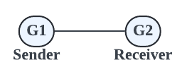
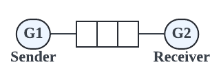

# 고루틴에서 계산한 값을 메인 루틴에서 얻는 방법?

```go
func main() {
    go func(a, b int) {
        c := a + b
    }(1,2)
    // 고루틴에서 계산한 c 값을 메모리 공유 없이 얻고 싶다. 어떻게 할 수 있을까?
}
```

# 채널(Channels)

- 고루틴 간 데이터 통신에는 채널이 사용된다.
- 채널은 고루틴 실행을 동기화하는데 도움이 된다.
- 하나의 고루틴은 다른 고루틴이 어떤 계산 단계에 있는지 알려주고 실행을 동기화할 수 있다.
- 채널은 특정 유형의 값을 송수신하는 데 사용된다.
- 채널은 스레드세이프하다. 여러 고루틴에서 동시에 값을 주고 받을 수 있는 채널 변수를 사용할 수 있다.

# 선언 및 초기화

```go
var ch chan T   // 채널 선언
ch = make(chan T)   // make 함수로 메모리 할당 -> make 함수는 할당된 메모리의 참조를 반환한다
```

또는

```go
ch := make(chan T) // 메모리 선언 및 할당
```

# `<-` 연산자

- 포인터 연산자를 사용하여 채널에서 값을 주고 받을 수 있으며 화살표 방향은 데이터 흐름의 방향을 나타낸다.

## 송신(Send)

송신의 경우 화살표 방향은 채널에 값을 쓰고 있음을 나타낸다.

```go
ch <- v
```

## 수신(Receive)

수신의 경우 화살표 방향은 채널로부터 값을 받아서 변수에 복사함을 나타낸다.

```go
v = <-ch
```

# 채널은 블락된다(Channels are blocking)

고루틴은 수신기가 준비되기를 기다린다.

```go
ch <- value
```

고루틴은 값이 전송되기를 기다린다.

```go
<- ch
```

채널은 값을 전송하거나 받을 준비가 되면 고루틴을 다시 실행할 수 있도록 만드는 책임이 있다.

# 채널 닫기

채널을 닫는 것은 송신 고루틴이 수신 고루틴에게 송신자는 채널에 보낼 값이 더 이상 없고 수신자가 블로킹을 해제하고 다른 계산을 진행할 수 있도록 한다.

```go
close(ch)
```

# 채널 값 수신

```go
value, ok = <- ch
// value: 채널로부터 수신한 값
// ok: 불리언 값. 채널에서 읽어오는 값이 쓰기에 의해 생성된 값인 경우 true, 채널 닫기에 의해 생성되는 기본 값인 경우 false.
```

# Range, Buffered Channels

```go
for value := range ch {
    // ...
}
```

수신 고루틴은 채널로부터 일련의 값을 수신할 때 범위(range)를 사용할수 있다. 범위를 사용하여 채널로부터 수신하는 값을 반복할 수 있다. 채널이 닫히면 반복문은 자동으로 종료된다. 따라서 송신 고루틴이 모든 값을 보내면 채널을 닫고 수신 고루틴은 범위 반복문에서 빠져나온다. range는 두 번째 불리언 값을 반환하지 않는다. 보통 수신은 두 번째 불리언 값을 반환하지만, 범위(range)는 값만 반환한다. 채널이 종료되면 자동으로 반복문을 빠져나오기 때문이다. 

# Unbuffered 채널(Unbuffered Channels)



- 동기적

```go
ch := make(chan Type)
```

이때까지 살펴본 채널은 Unbuffered 채널이다. 송신 고루틴과 수신 고루틴 사이에 버퍼가 없다. 버퍼가 없기 떄문에 송신 고루틴은 값을 받을 수 있는 수신 고루틴이 있을 때까지 블락된다. 또한 수신 고루틴은 값을 보낼 송신 고루틴이 있을 때까지 블락된다.

# Buffered 채널(Buffered Channels)



- 용량이 주어진 채널
- 인메모리 FIFO 큐
- 비동기적

```go
ch := make(chan Type, capacity)
```

버퍼 채널에는 송신/수신 고루틴 사이에 버퍼가 있다. 수신 고루틴이 값을 받을 준비가 되지 않은 상태에서 값을 전송할 수 있는 개수를 나타내는 버퍼 크기, 즉 용량(capacity)을 지정할 수 있다.

송신 고루틴은 버퍼가 가득 찰 때까지 블로킹 없이 값을 계속 보낼 수 있다. 버퍼가 가득 차면 송신 고루틴은 블락된다.

수신 고루틴은 버퍼가 빌 때까지 블로킹 없이 값을 받을 수 있다. 버퍼가 비게 되면 수신 고루틴은 블락된다.

버퍼 채널은 인메모리 FIFO 큐이므로 먼저 전송되는 요소가 먼저 읽힌다.

# 채널 방향(Channel Directions)

채널을 함수 파라미터로 사용할 경우, 채널이 수신용인지 송신용인지 정할 수 있다. 이 특성은 프로그램의 타입 안전성(type safety)을 높여준다.

```go
func pong(in <-chan string, out chan<- string) {} // <-chan은 수신용, chan<-은 송신용
```

# 채널 기본 값(Default value)

채널이 선언될 때, 기본값은 `nil`이다.

```go
var ch chan interface{}
```

따라서 내장 함수 `make`를 사용하여 메모리를 할당해줘야 한다.

`nil`인 채널에 읽기/쓰기를 하면 영원히 블로킹 상태가 된다.

```go
var ch chan interface{}
<-ch                // blocks forever
ch <- struct{}{}  // blocks forever
```

`nil`인 채널을 close 시도를 하면 패닉이 일어난다.

```go
var ch chan interface{}
close(ch)   // panic!
```

데드락과 패닉을 피하는 것은 중요하다!

# Ownership - Channels

```go
	owner := func() <-chan int {
		ch := make(chan int) // 채널 생성
		go func() {
			defer close(ch) // 채널 닫기
			for i := 0; i < 5; i++ {
				ch <- i // 채널에 쓰기
			}
		}()
		return ch // 채널 리턴
	}
```

- 채널 소유자는 채널을 인스턴스화하고, 쓰고, 닫는 고루틴이다.
- 채널 사용자는 채널에 대한 읽기 전용 보기만 제공한다.
- 따라서 채널의 소유권을 설정하면 데드락과 패닉을 피할 수 있으며, nil 채널에 쓰기, nil 채널 닫기 등과 같은 시나리오를 피할 수 있다. 