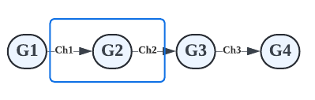
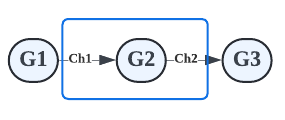

# 파이프라인(Pipeline)

- Go의 동시성 프리미티브를 활용하면 **스트리밍 파이프라인**을 간편하게 구현할 수 있다. 이를 통해 시스템이 **I/O 및 여러 CPU 코어를 효율적으로 활용**하여 계산을 더 빠르게 할 수 있다.
- 파이프라인은 스트림 또는 데이터 배치를 처리하는 데 사용된다.
- 파이프라인은 **채널로 연결된 일련의 스테이지로 구성**되며, **각 스테이지는 고루틴으로 표현**된다.
- 고루틴은 인바운드 채널에서 데이터를 가져와 작업을 수행하고 다음 스테이지에서 사용할 수 있는 아웃바운드 채널에 데이터를 보낸다.



## 스테이지(Stages)

- 파이프라인을 사용하면 **각 스테이지의 우려 사항을 분리**할 수 있으며, **개별 스테이지를 동시에 처리**할 수 있다.
- 스테이지는 같은 타입을 소비하고 반환할 수 있다.
    ```go
    func square(in <-chan int) <-chan int
    ```
- 이를 통해 파이프라인 합성이 가능하다.
    ```go
    square(square(generator(2, 3)))
    ```

## 이미지 프로세싱 파이프라인(Image Processing Pipeline)

- Input: 이미지 리스트
- Output: 썸네일 이미지

이 파이프라인은 이미지 리스트를 입력으로 받아 썸네일 이미지를 생성한 다음 디스크에 저장하거나 클라우드 스토리지 버킷으로 전송한다.

이 파이프라인에는 3개의 스테이지가 있다.



[스테이지1] 처리할 이미지 리스트를 생성하는 고루틴 G1을 실행한다. 채널 ch1을 통해 이미지 경로를 스테이지2로 전달한다.
[스테이지2] 고루틴 G2를 실행한다. 채널 ch1로부터 이미지 경로를 받아서 이미지를 처리하고 썸네일 이미지를 만든다. 썸네일 이미지 정보를 채널 ch2로 전송한다.
[스테이지3] 고루틴 G3를 실행한다. 채널 ch2로부터 썸네일 이미지 정보를 받는다. 썸네일 이미지를 디스크에 저장하거나 클라우드 스토리지 버킷에 저장한다.

우려 사항들을 **각 스테이지로 분리**하였다. G1은 처리할 이미지 리스트를 가져오는 것에만 관심이 있다. G2는 이미지 처리에만 관심이 있다. G3은 이미지를 저장하는 것에만 관심이 있다.

그리고 각 모든 스테이지는 머신에서 사용할 수 있는 여러 코어를 활용하여 **병렬로 실행**할 수 있다.

처리해야할 이미지가 너무 많으면 스테이지2에서 고루틴 수를 확장하여 이미지를 더 빠르게 처리할 수 있다.
