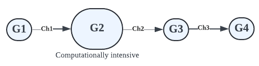
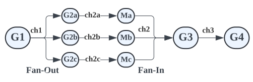

# 파이프라인(Pipeline)

- Go의 동시성 프리미티브를 활용하면 **스트리밍 파이프라인**을 간편하게 구현할 수 있다. 이를 통해 시스템이 **I/O 및 여러 CPU 코어를 효율적으로 활용**하여 계산을 더 빠르게 할 수 있다.
- 파이프라인은 스트림 또는 데이터 배치를 처리하는 데 사용된다.
- 파이프라인은 **채널로 연결된 일련의 스테이지로 구성**되며, **각 스테이지는 고루틴으로 표현**된다.
- 고루틴은 인바운드 채널에서 데이터를 가져와 작업을 수행하고 다음 스테이지에서 사용할 수 있는 아웃바운드 채널에 데이터를 보낸다.


## 스테이지(Stages)

- 파이프라인을 사용하면 **각 스테이지의 우려 사항을 분리**할 수 있으며, **개별 스테이지를 동시에 처리**할 수 있다.
- 스테이지는 같은 타입을 소비하고 반환할 수 있다.
    ```go
    func square(in <-chan int) <-chan int
    ```
- 이를 통해 파이프라인 합성이 가능하다.
    ```go
    square(square(generator(2, 3)))
    ```

## 이미지 프로세싱 파이프라인(Image Processing Pipeline)

- Input: 이미지 리스트
- Output: 썸네일 이미지

이 파이프라인은 이미지 리스트를 입력으로 받아 썸네일 이미지를 생성한 다음 디스크에 저장하거나 클라우드 스토리지 버킷으로 전송한다.

이 파이프라인에는 3개의 스테이지가 있다.


[스테이지1] 처리할 이미지 리스트를 생성하는 고루틴 G1을 실행한다. 채널 ch1을 통해 이미지 경로를 스테이지2로 전달한다.
[스테이지2] 고루틴 G2를 실행한다. 채널 ch1로부터 이미지 경로를 받아서 이미지를 처리하고 썸네일 이미지를 만든다. 썸네일 이미지 정보를 채널 ch2로 전송한다.
[스테이지3] 고루틴 G3를 실행한다. 채널 ch2로부터 썸네일 이미지 정보를 받는다. 썸네일 이미지를 디스크에 저장하거나 클라우드 스토리지 버킷에 저장한다.

우려 사항들을 **각 스테이지로 분리**하였다. G1은 처리할 이미지 리스트를 가져오는 것에만 관심이 있다. G2는 이미지 처리에만 관심이 있다. G3은 이미지를 저장하는 것에만 관심이 있다.

그리고 각 모든 스테이지는 머신에서 사용할 수 있는 여러 코어를 활용하여 **병렬로 실행**할 수 있다.

처리해야할 이미지가 너무 많으면 스테이지2에서 고루틴 수를 확장하여 이미지를 더 빠르게 처리할 수 있다.

# 팬아웃 & 팬인(Fan-out & Fan-in)

가끔씩 파이프라인의 특정 스테이지는 계산이 많이 필요하고 결과를 만드는 데 오랜 시간이 걸릴 수 있다.

예를 들어, 아래 파이프라인에서 고루틴 G2는 계산 집약적인 스테이지다. 고루틴 G2가 채널 ch2에 값을 보내는 데는 시간이 걸린다.



결과적으로, 고루틴 G3와 G4는 G2가 값을 보내는 것을 기다리는 동안 블락되게 된다.

그렇다면, 계산 집약적인 스테이지를 여러 개의 고루틴 인스턴스로 분할하여 병렬로 실행하여 처리 속도를 높일 수 있을까? 

=> Fan-out, Fan-in 패턴

- 팬아웃(Fan-out)
  - 채널의 입력을 처리하기 위해 여러 고루틴을 시작할 때 사용하는 용어
  - 여러 개의 고루틴이 동일한 채널에서 데이터를 읽는다.
  - 팬아웃을 통해 워커 고루틴 그룹 간에 작업을 분산하여 CPU 사용량과 I/O 사용량을 병렬화할 수 있다.
- 팬인(Fan-in)
  - 여러 결과를 하나의 채널로 결합하는 과정을 설명하는 용어



위 다이어그램에서 고루틴 G2a, G2b, G2c는 동일한 채널인 ch1로부터 데이터를 읽는다. 계산 결과를 각각 ch2a, ch2b, ch2c에 전송한다. **병합 고루틴** Ma, Mb, Mc이 여러 채널의 결과값을 모아서 하나의 채널 ch2에 전송한다. ch2는 이런 식으로 계산 집약적인 단계를 병렬화함으로써 계산 속도를 높일 수 있다. 

요약하자면, 팬아웃(Fan-out)에서는 단일 채널에서 데이터를 읽기 위해 여러 개의 고루틴을 시작하여 CPU 사용량과 I/O 사용량을 병렬화하는 작업을 고루틴 그룹 간에 분산할 수 있다. 이를 통해 계산 집약적인 스테이지가 더 빠르게 실행되고 파이프라인이 더 빠르게 실행될 수 있다.

# 고루틴 취소하기

## 우리가 공부했던 파이프라인 패턴

- 업스트림 스테이지는 모든 전송 연산이 완료되었을 때 아웃바운드 채널을 닫는다.
    ```go
    func generator(nums ...int) <-chan int {
        out := make(chan int)
        go func() {
            for _, n := range nums {
                out <- n
            }
            close(out) // 업스트림 스테이지는 모든 전송 연산이 완료되었을 때 아웃바운드 채널을 닫는다.
        }()
        return out
    }
    ```
- 다운스트림 스테이지는 채널이 닫힐 때까지 인바운드 채널로부터 값을 받아온다.
    ```go
    func square(in <-chan int) <-chan int {
        out := make(chan int)
        go func() {
            for n := range in { // 다운스트림 스테이지는 채널이 닫힐 때까지 인바운드 채널로부터 값을 받아온다.
                out <- n*n
            }
            close(out)
        }()
        return out
    }
    ```
- 이 패턴은 각각의 수신 스테이지가 range 반복문으로 쓰인다.
- 모든 값이 성공적으로 다운스트림으로 보내지면, 모든 고루틴은 종료된다.
    ```go
    func merge(cs ...<-chan int) <-chan int {
        out := make(chan int)
    	var wg sync.WaitGroup

        output := func(c <-chan int) {
            for n := range c {
                out <- n
            }
            wg.Done()
        }

        wg.Add(len(cs))
        for _, c := range cs {
            go output(c)
        }

        go func() { // 모든 값이 성공적으로 다운스트림으로 보내지면, 모든 고루틴은 종료된다.
            wg.Wait() // 모든 고루틴이 종료될 때까지 기다린다.
            close(out) // 합병된 out 채널을 닫는다. -> 메인 고루틴이 range 반복문에서 벗어나도록 한다.
        }()
    }
    ```

    ```go
    func main() {
        in := generator(2, 3)

        ch1 := square(in)
        ch2 := square(in)

        for n := range merge(ch1, ch2) { // 합병된 out 채널이 닫히면 메인 고루틴이 range 반복문에서 벗어난다.
            fmt.Println(n)
        }
    }
    ```

## 실제 파이프라인

- 실제 파이프라인에서, 수신 스테이지가 모든 인바운드 값을 받을 필요는 없다.
- 인바운드 값이 에러를 나타낼 경우, 스테이지가 빨리 종료될 수 있다.
- 수신 스테이지가 아직 도착하지 않은 값들을 모두 기다릴 필요는 없다.
- 나중 스테이지에 필요하지 않은 값을 이전 스테이지에서 생산하는 것을 피하는 것이 좋다.
    ```go
    func main() {
        in := generator(2, 3)

        c1 := square(in)
        c2 := square(in)

        out := merge(c1, c2)

        fmt.Println(<-out) // 하나의 값만 받고 merge로부터의 인바운드 채널을 포기한다면, merge 스테이지의 고루틴은 채널 전송 연산이 블락된다. 결과적으로 square 안의 고루틴과 generator 스테이지 또한 채널 전송 연산이 블락된다. 이는 고루틴 릭(Goroutine leak)을 발생시킨다.
    }
    ```
- 이는 고루틴 릭(Goroutine leak)을 발생시킨다.

## 고루틴 취소

- 고루틴에 읽기 전용 `done` 채널을 전딜한다.
- 채널을 닫는다. 모든 고루틴에 broadcast 시그널을 보낸다.
- 채널로 시그널을 받으면, 고루틴은 작업을 버리고 종료된다.
- `select`을 사용하여 수신을 `done` 채널로 다중화하여 채널에서 송수신 작업을 선점한다.
    ```go
    select {
    case out <- n:
    case <-done:
        return
    }
    ```