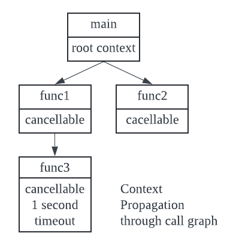

# Context Package

Go 서버에서 들어오는 각각의 요청은 고유한 고루틴으로 처리된다. 요청 핸들러는 데이터베이스와 RPC 서비스와 같은 백엔드에 접근하기 위해 추가적인 고루틴을 시작하기도 한다. 요청에 작업하는 고루틴 세트는 일반적으로 최종 사용자의 ID, 인증 토큰 및 요청 기한과 같은 특정 값을 요청하기 위해 액세스가 필요하다. 요청이 마지막에 취소되거나 요청 시간이 초과되면 해당 요청에 대해 작업하는 모든 고루틴이 신속하게 종료되어 시스템이 사용 중이던 리소스를 회수할 수 있기를 바란다. 따라서 요청 범위(request scoped)에 있는 데이터를 호출 그래프 아래로 모든 고루틴에 전파하는 방법이 필요하고, 취소 신호를 호출 그래프 아래로 모든 고루틴에 전파하는 방법이 필요하다. 여기서 `context` 패키지가 작동한다.

## Context Package

Context 패키지는 크게 두 가지 목적을 수행한다.

- 호출 그래프의 분기를 취소하기 위한 API를 제공한다.
- 호출 그래프를 통해 요청 범위(request scoped) 데이터를 전송하기 위한 데이터백을 제공한다.

다음은 호출 그래프를 통해 컨텍스트 전파가 어떻게 발생할 수 있는지 보여주는 예이다.



- 메인 루틴은 루트 컨텍스트를 생성하고 루트 컨텍스트에서 취소 가능한 컨텍스트를 파생하여 이를 func1와 func2에 전달한다. func1은 취소 가능한 컨텍스트에서 새 컨텍스트를 파생하고 타임아웃을 1초로 설정하여 func3에 전달한다.
- func3은 1초 전에 계산을 완료하거나 타임아웃을 지키고 컨텍스트가 취소되면 반환되도록 되어 있다.
- func2의 컨텍스트는 타임아웃의 영향을 받지 않으며, 컨텍스트가 값으로 전달되므로 여전히 취소 가능한 컨텍스트이다.
- 개별 호출 그래프는 상위 호출 그래프의 컨텍스트에 영향을 주지 않고 자체 속성을 가질 수 있다.

```go
type Context interface {
    // Deadline returns the time when work done on behalf of this context
    // should be caceled. Deadline returns ok==false when no deadline is
    // set. Successive calls to Deadline returns the same results.
    Deadline() (deadline time.Time, ok bool)

    // Done returns a channel that's closed when work done on behalf of this
    // context should be canceled. Done may return nil if this context can
    // never be canceled. Successive calls to Done return the same value.
    // The close of the Done channel may happen asynchronously,
    // after the cancel function returns.
    // 
    // WithCancel arranges for Done to be closed when cancel is called;
    // WithDeadline arranges for Done to be closed when the deadline
    // expires; WithTimeout arranges for Done to be closed when the timeout
    // elapes.
    //
    // Done is provided for use in select statements:
    //
    // // Stream generates values with DoSomething and sends them to out
    // // until DoSomething returns an error or ctx.Done is closed.
    // func Stream(ctx context.Context, out chan<- Value) error {
    //     for {
    //         v, err := DoSomething(ctx)
    //         if err != nil {
    //             return err
    //         }
    //         select {
    //         case <-ctx.Done():
    //             return ctx.Err()
    //         case out <- v:
    //         }
    //     }
    // }
    Done() <-chan struct{}

    // If Done is not yet closed, Err returns nil.
    // If Done is closed, Err returns a non-nil error explaining why:
    // Canceled if the context was canceled
    // or DeadlineExceeded if the context's deadline passed.
    // After Err returns a non-nil error, successive calles to Err return the same error.
    Err() error

    // Value returns the value associated with this context for key, or nil
    // if no value is associated with key. Successive calls to Value with
    // the same key returns the same result.
    //
    // Use context values only for request-scoped data that transits
    // processes and API boundaries, not for passing optional parameters to functions.
    //
    // A key identifies a specific value in a Context. Functions that wish
    // to store values in Context typically allocate a key in a global
    // variable then use that key as the argument to context.WithValue and
    // Context.Value. A key can be any type that supports equality;
    // packages should define keys as an unexported type to avoid collisions.
	//
	// Packages that define a Context key should provide type-safe accessors
	// for the values stored using that key:
	//
	// 	// Package user defines a User type that's stored in Contexts.
	// 	package user
	//
	// 	import "context"
	//
	// 	// User is the type of value stored in the Contexts.
	// 	type User struct {...}
	//
	// 	// key is an unexported type for keys defined in this package.
	// 	// This prevents collisions with keys defined in other packages.
	// 	type key int
	//
	// 	// userKey is the key for user.User values in Contexts. It is
	// 	// unexported; clients use user.NewContext and user.FromContext
	// 	// instead of using this key directly.
	// 	var userKey key
	//
	// 	// NewContext returns a new Context that carries value u.
	// 	func NewContext(ctx context.Context, u *User) context.Context {
	// 		return context.WithValue(ctx, userKey, u)
	// 	}
	//
	// 	// FromContext returns the User value stored in ctx, if any.
	// 	func FromContext(ctx context.Context) (*User, bool) {
	// 		u, ok := ctx.Value(userKey).(*User)
	// 		return u, ok
	// 	}
    Value(key any) any
}
```

## Context Package Functions

- context.Background()
- context.TODO()

## Background()

```go
func main() {
    ctx := context.Background()
}
```

- Background는 비어있는 컨텍스트를 반환한다. 컨텍스트 트리의 루트이다. 취소되지 않으며 값과 데드라인이 없다.
- 일반적으로 메인 함수에서 사용되며, 들어오는 요청에 대한 최상위 컨텍스트 역할을 한다.

## TODO()

```go
func fun() {
    ctx := context.TODO()
}
```

- TODO()는 비어있는 컨텍스트를 반환한다.
- 플레이스홀더 역할을 하기 위한 목적으로 제공된다.
- 어떤 컨텍스트를 활용할지 모르거나 코드에 컨텍스트가 제공되기를 기대하지만 업스트림 코드가 아직 컨텍스트를 제공하지 않은 경우 TODO 컨텍스트를 플레이스홀더로 사용한다.

# Context Package for cancellation

- 컨텍스트 자체는 불변(immutable)이므로, 동작을 추가하려면 기존 컨텍스트에서 새로운 컨텍스트 값을 파생해야 한다.
- 컨텍스트 패키지는 취소 동작을 추가하는 기능을 제공한다.
  - context.WithCancel()
  - context.WithTimeout()
  - context.WithDeadline()
- 이 함수들은 컨텍스트의 새 인스턴스를 생성하고 함수의 동작과 관련된 옵션을 추가한다.
- 파생된 컨텍스트는 취소를 용이하게 하기 위해 하위 고루틴에 전달된다.

## WithCancel()

```go
// Create a context that is cancellable.
ctx, cancel := context.WithCancel(context.Background())
defer cancel()
```

- WithCancel() 함수는 상위 컨텍스트를 입력으로 받는다.
- WithCancel() 함수는 새로운 Done 채널과 cancel 함수와 함께 상위 컨텍스트의 복사본을 반환한다. cancel 함수는 컨텍스트의 Done 채널을 닫기 위해 사용된다.
- Done 채널을 닫는 것은 해당 작업을 포기하고 반환하는 작업을 나타낸다.
- 컨텍스트를 취소하면 컨텍스트와 연결된 리소스가 해제된다.
- 작업이 실행되고 컨텍스트가 완료되자마자 cancel 함수를 호출하는 것이 좋다. cancel 함수를 호출하지 않으면 메모리 누수가 발생하고, 현재 컨텍스트가 취소되거나 상위 컨텍스트가 취소될 때까지 컨텍스트와 연관된 리소스가 해제되지 않는다.

## cancel()

- cancel()은 작업이 중지될 때까지 기다리지 않는다.
- 완료된 채널을 닫고 반환한다.
- 취소 함수는 첫 번째 호출 후 여러 고루틴에서 동시에 호출할 수 있으나, 취소 함수에 대한 후속 호출은 아무 것도 하지 않고 그냥 반환된다.

```go
// Parant Goroutine
// Create a context that is cancellable.
ctx, cancel := context.WithCancel(context.Background())
ch := generator(ctx)
//...
if n == 5 {
    cancel()
}
```

```go
// Child goroutine
for {
    select {
    case <- ctx.Done():
        return ctx.Err()
    case dst <- n:
        n++
    }
}
```

## WithDeadline()

```go
deadline := time.Now().Add(5*time.Millisecond)
ctx, cancel := context.WithDeadline(context.Background(), deadline)
defer cancel()
```

## WithTimeout()

```go
duration := 5*time.Millisecond
ctx, cancel := context.WithTimeout(context.Background(), duration)
defer cancel()
```

## WithTimeout과 WithDeadline의 차이점

- WithTimeout(): context가 생성되는 순간부터 타이머 카운트다운 시작
- WithDeadline(): 타이머가 만료되는 시간을 설정

# Context Package as Data bag

- Context 패키지는 요청 범위 데이터를 호출 그래프 아래로 전송하는 데 사용될 수 있다.
- context.WithValue()를 사용하여 요청 범위 값을 컨텍스트와 연결한다.

## WithValue()

```go
// Parent Goroutine
type userIDType string
ctx := context.WithValue(context.Background(), userIDType("userIDKey"), "jane")
```

```go
// Child Goroutine
userid := ctx.Value(userIDType("userIDKey")).(userIDType)
```

- WithValue() 함수는 부모 컨텍스트와 키-값 쌍을 입력으로 받는다. 키와 값이 연결된 상위 컨텍스트의 복사본을 반환한다.
- 제공된 키는 호환되어야 하며, 키에 대한 사용자 정의 데이터 타입을 정의해야 한다.

# Context Package - Go Idioms

## 서버로 들어오는 모든 요청을 컨텍스트를 생성해야 한다!

- 작업 또는 요청을 처리할 때 초기에 컨텍스트를 만든다.
- 최상위 수준 컨텍스트를 만든다.
  ```go
  func main() {
    ctx := context.Backgroud()
  }
  ```
- `http.Request`값은 Context를 이미 가지고 있다.
  ```go
  func handleFunc(w http.ResponseWriter, req *http.Request) {
    ctx, cancel = context.WithCancel(req.Context())
  }
  ```
- `ctx` 변수명을 사용하는 것이 Go Idiom이다.

## 서버로 나가는 호출은 컨텍스트를 수용해야 한다

- 고수준 호출은 저수준 호출에 대기 시간을 알려주어야 한다.
  ```go
  // Create a context with a timeout of 100 milliseconds.
  ctx, cancel := context.WithTimeout(req.Context(), 100*time.Millisecond)
  defer cancel()

  // Bind the new context into the request.
  req = req.WithContext(ctx)

  // Do will handle the context level timeout.
  resp, err := http.DefaultClient.Do(req)
  ```
- 타임아웃 내에 http 요청에 대해 서버로부터 응답을 받지 못하면 DefaultClient Do 메서드가 타이머 만료시 취소 신호 후 에러 메시지와 함께 리턴된다.

## I/O를 수행하는 함수에 컨텍스트를 전달한다

I/O 작업을 수행하는 모든 작업은 컨텍스트 값을 첫 번째 파라미터로 받고, 호출자가 구성한 타임아웃 또는 데드라인을 준수해야 한다.

표준 라이브러리의 컨텍스트 인식 API는 컨텍스트를 입력으로 사용하며, 첫 번째 파라미터를 컨텍스트 값으로 갖는 것이 Go Idiom이다.

## 컨텍스트 값을 변경하면 새로운 컨텍스트 값이 생성되어 앞으로 전파된다

```go
func main() {
    ctx, cancel = context.NewCancel(context.Background())
    defer cancel()

    // ...

    go func(ctx context.Context) {
        ctx, cancel := context.WithTimeout(ctx, 1*time.Second)
        defer cancel()

        // ...

        func(ctx context.Context) (string, error) {
            select {
                case <-ctx.Done():
                return "", ctx.Err()
                // ..
            }
        }()
    }(ctx)
}
```

## 컨텍스트가 취소되면 해당 컨텍스트에서 파생된 모든 컨텍스트도 취소된다

상위 컨텍스트가 취소되면 해당 상위 컨텍스트에서 파생된 모든 하위 컨텍스트도 취소된다.

## 어떤 컨텍스트를 사용해야 할지 확실하지 않은 경우 TODO 컨텍스트를 사용한다

함수가 최상위 컨텍스트 생성을 담당하지 않고 실제 컨텍스트가 어디에서 오는지 알아낼 때까지 임시 최상위 컨텍스트가 필요한 경우 TODO를 사용한다.

## 요청 범위 데이터에만 컨텍스트 값을 사용한다

선택적 파라미터를 함수에 전달하지 않는다. 요청 범위 데이터에 대해서만 컨텍스트 값을 사용해야 한다.

함수는 빈 컨텍스트 값을 사용해도 논리를 실행할 수 있어야 한다.