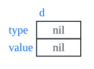
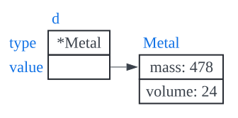
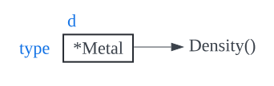
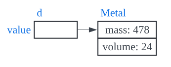
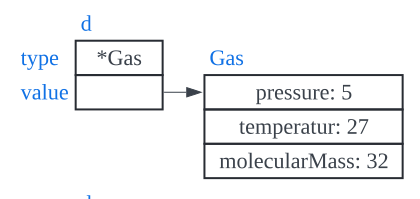
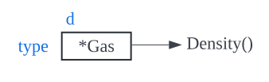

# Interface values

개념적으로 인터페이스 타입의 값에는 동적 타입과 동적 값이라는 두 가지 구성 요소가 있다.

- 동적 타입(Dynamic type)
- 동적 값(Dynamic value)

```go
var d Dense
```



인터페이스 타입의 변수를 선언하면 동적 타입과 동적 값이 nil로 설정된다.

```go
d = &gold
```




변수 gold에 대한 포인터 값을 할당하면 인터페이스 동적 타입이 Metal 포인터 타입인 타입 디스크립터로 설정된다.

```go
d.Density()
```



인터페이스를 통해 메서드를 호출하면 동적 디스패치(dynamic dispatch)를 사용한다. 컴파일러는 타입 디스크립터로부터 메서드 주소를 얻기 위해 코드를 생성한다. 따라서 런타임에 해당 주소에서 간접 호출이 이루어진다.

호출에 대한 리시버 인수는 인터페이스 동적 값의 복사본이다.



```go
d.Density()
// ->
gold.Density
```

따라서 인터페이스를 통해 메서드를 호출하면 해당 타입의 값에서 메서드를 호출하는 것과 동일해진다.

Gas 타입의 값을 인터페이스에 할당했을 때, 동적 타입이 Gas 타입에 대한 포인터로 설정되고 동적 값이 oxygen 변수의 값을 가리킬 때도 비슷하게 동작한다.

```go
d = &oxygen
```




```go
d.Density()
```



Density() 메서드를 호출하면 타입 디스크립터의 메서드 주소를 사용하여 동적 값을 리시버 값으로 사용하는 메서드를 간접적으로 호출한다.

# Interface의 목적

## 캡슐화(Encapsulate)

인터페이스를 사용하면 사용자 정의 타입의 메서드 내에 로직을 캡슐화할 수 있다.

```go
func (m *Metal) Density() float64 {
    return m.mass / m.volmue
}

func (g *Gas) Density() float64 {
    var density float64
    density = (g.molecularMass * g.pressure) / (0.0821 * (g.temperature + 273))
    return density
}
```

데이터 타입 Metal과 Gas는 각각 밀도를 계산하는 고유한 공식이 있다. 따라서 해당 로직을 메서드 내에 캡슐화할 수 있다.

## 추상화(Abstraction)

인터페이스는 기본 구체적인 타입의 동작을 보장하는 상위 수준 함수에 대한 추상화를 제공하므로 상위 수준 함수가 특정 구현의 세부 사항에 묶여있지 않으므로 다양한 코드를 작성할 수 있다.

```go
func IsDenser(a, b Dense) bool {
    return a.Density() > b.Density()
}

result := IsDenser(&gold, &silver)

result = IsDenser(&oxygen, &hydrogen)
```

# 암시적 인터페이스(Interface-implicit)

암시적 인터페이스는 좋은 디자인으로 이어진다.

## 인터페이스(Interfaces)

- 인터페이스는 암묵적으로(implicitly) 충족된다!
- Java에서는 명시적으로 인터페이스를 구현하는 것으로 클래스를 선언하지만 Go에서는 그러한 명시적인 구문이 없다.

아래는 Java에서의 인터페이스 구현 예시이다.

```java
class Bicycle implements Vehicle{
```

- 사용자 정의 타입은 인터페이스의 인스턴스로 간주되기 위해 인터페이스에 정의된 메서드를 소유하기만 하면 된다.
- 인터페이스의 정의는 구현과 분리된다. 이는 많은 유연성을 제공한다.
- 구현 전에 인터페이스를 정의해야 함으로써 프로젝트 시작 단계에서 추상화에 얽매일 필요가 없다!
- Go에서는 추상화가 명확해지면 인터페이스를 정의할 수 있다.
- 이 설계를 통해 우리는 기존의 구체적인 타입을 충족하는 새로운 인터페이스를 만들 수 있다. 모든 구현으로 돌아가서 태그를 지정할 필요가 없다. 표준 라이브러리나 서드파티 코드처럼 구현이 통제를 받지 않는 경우 때로는 불가능할 수도 있다.
- 인터페이스 정의와 구체적인 타입 정의는 사전 조정 없이 모든 패키지에 나타날 수 있다. 따라서 다른 패키지를 가져올 필요 없이 원하는 서명으로 인터페이스를 정의할 수 있는 새 패키지를 구현할 때 종속성을 추상화하는 것이 더 쉬워진다.

## 컨벤션(Convention)

- 인터페이스를 단순하고 짧게 유지한다.
- 통일된 방식으로 처리해야 하는 두 개 이상의 구체적인 타입이 있는 경우 인터페이스를 정의한다.
- 더 적고 간단한 방법으로 더 작은 인터페이스를 만든다.